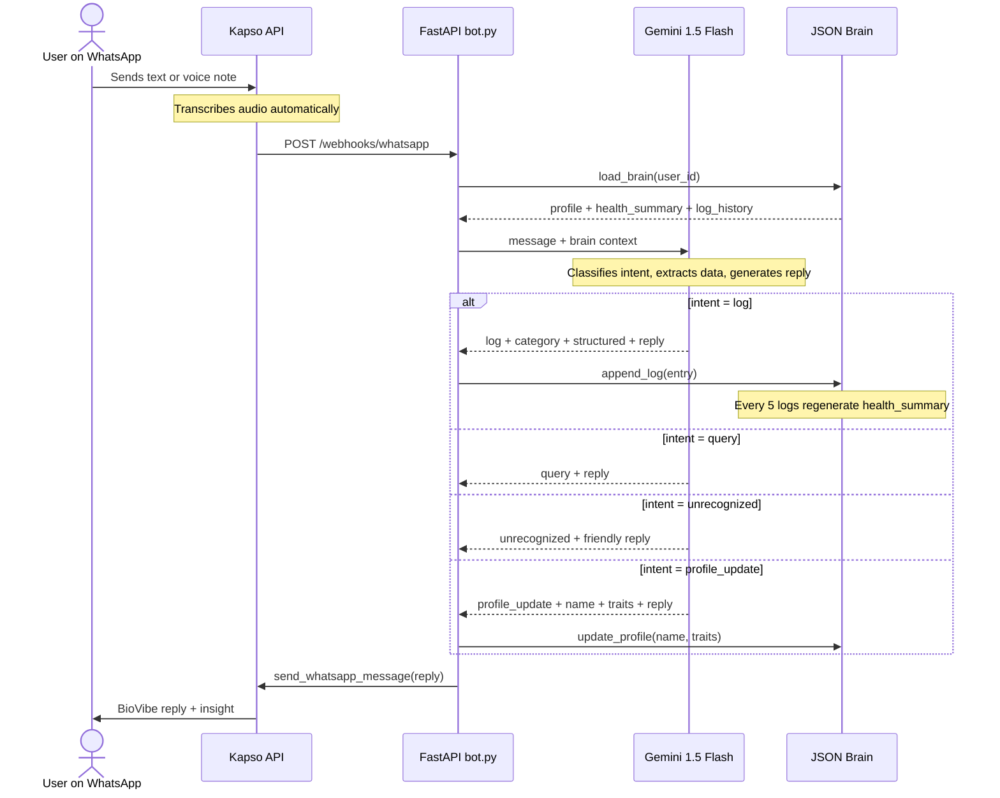

# BioVibe – AI-Driven Biohacking Assistant

**Status:** Draft / Hackathon MVP  
**Stack:** Gemini 1.5 Flash · FastAPI · WhatsApp (Kapso) · Ngrok

---

## Solution Overview



---

## How We Built It

Rather than jumping straight into code, we applied a structured engineering methodology from the first minute of the hackathon.

### 1. Product First — PRD Before Code

We started by writing this PRD: executive summary, problem statement, functional requirements, data model, and a sequence diagram. This forced alignment on what we were building before anyone opened a code editor.

### 2. Structured Prompt Engineering

Each implementation task was designed as a **self-contained prompt** following a professional prompt engineering structure:

| Section | Purpose |
|---|---|
| **Persona** | Defines who the AI is acting as (senior software engineer) |
| **Context** | Full technical reference — codebase structure, schemas, conventions |
| **Pre-conditions** | What must exist before this prompt can run |
| **Objective** | Numbered, unambiguous tasks with no room for interpretation |
| **Outcome** | Exact function signatures, file paths, and JSON schemas expected |
| **Acceptance Check** | A concrete test the engineer runs to verify before moving on |

This eliminated the most common AI coding failure: the agent having to guess what was already built.

### 3. Decoupled Parallel Execution

Prompts were designed so different team members could work independently:

```
01-brain          (no deps)
    ├──► 02-gemini + bot  ──► 04-gemini tests
    └──► 03-brain tests
              └──► 05-profile update ──► 06-profile tests
```

No verbal handoff needed — every prompt includes enough context to be picked up cold by any team member on any machine.

### 4. Docs as the Single Source of Truth

`docs/00-context-prompt.md` acts as the living technical reference — intent model, data schemas, message flow, coding conventions — kept in sync with every decision made during the hackathon.

---

## 1. Executive Summary

BioVibe is a conversational AI agent for WhatsApp that eliminates the friction of health tracking. Instead of manual data entry in complex apps, users send quick voice notes or text messages about meals, symptoms, and habits. BioVibe acts as the "Brain" — storing a longitudinal history in JSON format to identify correlations and surface proactive biohacking insights.

---

## 2. Problem Statement

Health enthusiasts and high-performers consistently fail to track their data because traditional apps require too many clicks and context switches. This creates **data silos** where symptoms (e.g., a headache) are never linked to root causes (e.g., poor sleep or specific foods), making pattern discovery impossible.

---

## 3. The "AI as the Brain" Concept

Unlike a standard chatbot, BioVibe:

| Capability | Description |
|---|---|
| **Multimodal Input** | Accepts voice notes and text; Kapso transcribes audio automatically before it reaches the AI |
| **State Management** | Maintains an evolving user profile, not just a message log |
| **Insight Synthesis** | Cross-references today's log with full history to surface patterns |

---

## 4. Functional Requirements

### FR1 – Multimodal Ingestion

- Accept voice notes (`.ogg` / `.mp3`) and plain text messages via WhatsApp.
- Kapso transcribes audio automatically and delivers the transcript alongside the message — no separate transcription step needed.
- Gemini receives the transcript as plain text and extracts structured data in a single pass.

### FR2 – Intent Recognition

Before any logging or response, the system must classify the user's input into one of three intents:

| Intent | Description | Examples |
|---|---|---|
| **Log** | User is recording health data | "Lunch was pasta", "I have a headache", "Ran 5km" |
| **Query** | User is asking a health-related question or summary | "How was my mood this week?", "What is gluten?", "Am I sleeping enough?" |
| **Unrecognized** | Message is unrelated to the service scope | "Send me a joke", "What's the weather?", "Hello" |
| **Profile Update** | User shares persistent personal information | "I'm lactose intolerant", "My name is Rodrigo", "I'm vegetarian" |

- **Log intent** → proceed to FR3 (extract structured data, save to Brain, reply with insight)
- **Query intent** → answer using the user's history as context; do **not** create a new log entry
- **Unrecognized intent** → reply with a friendly message explaining what the user can send; do **not** create a log entry
- **Profile Update intent** → update `profile.name` and/or `profile.traits`; do **not** create a log entry

This prevents polluting the JSON Brain with irrelevant data and ensures the history stays meaningful.

### FR3 – Structured Health Logging

- Only triggered after a **Log** intent is confirmed (see FR2).
- Categorize the log into one of: **Nutrition · Symptom · Activity · Sleep · Mood**.
- Extract data into a consistent JSON schema with fields such as `ingredients`, `duration`, and `intensity`.

**Example log entry:**

```json
{
  "timestamp": "2026-05-05T14:30:00Z",
  "category": "Nutrition",
  "raw_input": "Had a bowl of pasta with cheese for lunch",
  "structured": {
    "meal": "pasta with cheese",
    "ingredients": ["pasta", "cheese"],
    "estimated_calories": 650
  }
}
```

### FR4 – Persistent Memory (The JSON Brain)

- Maintain one local JSON file per `user_id`.
- File structure:

```json
{
  "user_id": "5511999999999",
  "profile": {
    "name": "Rodrigo",
    "traits": ["Lactose Intolerant", "intermittent faster"]
  },
  "health_summary": "AI-generated narrative, updated every 5 logs.",
  "log_history": []
}
```

- The `health_summary` field is regenerated by Gemini every **5 new log entries**.

### FR5 – Proactive Insights (The Biohacker Persona)

- Every response must close with a personalised **Insight** derived from the user's history.
- Insight must reference at least one past log entry when available.

> **Example:** *"You've reported low energy 30 minutes after eating pasta twice this week. Consider testing a lower-carb lunch tomorrow."*

---

## 5. Technical Requirements

| Concern | Decision |
|---|---|
| **API framework** | FastAPI (webhook listener) |
| **LLM** | `gemini-1.5-flash` — speed + native audio |
| **Storage** | Local JSON filesystem, one file per user |
| **Tunneling** | Ngrok (dev only) |
| **WhatsApp integration** | Kapso API (hackathon sandbox) |

### Codebase Structure

```
app/
├── main.py                  # FastAPI entrypoint, router registration
├── bot.py                   # handle_inbound() + inbound_text() — orchestrates message flow
├── config.py                # Settings via pydantic-settings / .env
├── prompts/
│   └── biovibe_system.txt   # Gemini system prompt (loaded at runtime)
├── routers/
│   ├── webhooks.py          # GET (verification) · POST (inbound) · POST /debug
│   ├── api.py               # POST /api/send-text · GET /api/kapso/account
│   └── health.py            # GET /health
├── schemas/
│   ├── kapso/               # KapsoWebhook, KapsoMessage, etc.
│   └── messages.py          # SendTextRequest, MessageResponse, HealthResponse
└── services/
    ├── kapso_client.py      # Async HTTP wrapper for Kapso REST API
    ├── gemini_client.py     # Gemini SDK wrapper — intent, extraction, reply
    └── brain.py             # JSON Brain read/write (synchronous)

data/                        # Created at runtime — one JSON file per user
```

### Endpoints

| Method | Path | Purpose |
|---|---|---|
| `GET` | `/health` | Health check |
| `GET` | `/` | Service info / links |
| `GET` | `/webhooks/whatsapp` | Kapso webhook verification (hub challenge) |
| `POST` | `/webhooks/whatsapp` | Inbound message handler → calls `bot.handle_inbound` |
| `POST` | `/webhooks/whatsapp/debug` | Echo raw payload — use while wiring Kapso locally |
| `POST` | `/api/send-text` | Manual outbound text (curl / Postman tests) |
| `GET` | `/api/kapso/account` | Confirms API key against Kapso platform |

### Message Processing Flow

```
WhatsApp User
    │
    ▼
Kapso Webhook ──► POST /webhooks/whatsapp   (routers/webhooks.py)
    │
    │  signature check + KapsoWebhook schema validation
    │
    ▼
bot.handle_inbound(msg, client)             (bot.py)
    │
    ├── bot.inbound_text(msg)
    │       ├── msg.type == "text"      → msg.text.body
    │       ├── msg.interactive         → button_reply / list_reply title
    │       ├── msg.button              → button text / payload
    │       └── msg.kapso.content       → fallback
    │
    ▼  [TO IMPLEMENT for BioVibe]
    │
    │  inbound_text(msg) returns plain text in both cases:
    ├── msg.type == "text"  → msg.text.body
    └── msg.type == "audio" → msg.kapso.content (Kapso transcribes automatically)
                                                        │
                                                        ▼
                                          Gemini (text + brain context)
                                                        │
                                                        ▼
                          ┌────────── Intent Recognition ──────────┐
                          │            │               │           │
                         LOG         QUERY       UNRECOGNIZED  PROFILE_UPDATE
                          │            │               │           │
                          ▼            ▼               ▼           ▼
                 Extract structured  Answer using   Friendly   Update profile
                   log entry        Brain history   reply only  (name + traits)
                          │            │                           │
                          ▼            │                           │
                 Update JSON Brain     │                           │
                 (data/{user_id}.json) │                           │
                          │            │                           │
                          ▼            │                           │
                 Generate insight ◄────┴───────────────────────────┘
                                        │
                                        ▼
                           client.send_whatsapp_message()
                           (services/kapso_client.py)
```

---

## 6. Data Model

### User Brain File (`data/{user_id}.json`)

```json
{
  "user_id": "string",
  "profile": {
    "name": "string | null",
    "traits": ["string"]
  },
  "health_summary": "string",
  "log_history": [
    {
      "id": "uuid",
      "timestamp": "ISO8601",
      "category": "Nutrition | Symptom | Activity | Sleep | Mood",
      "raw_input": "string",
      "media_type": "text | audio",
      "structured": {}
    }
  ]
}
```

---

## 7. User Stories

| ID | Story |
|---|---|
| US-01 | As a user, I want to send a voice note of my lunch so I don't have to type ingredients. |
| US-02 | As a user, I want the assistant to remember my allergies so it can warn me proactively. |
| US-03 | As a user, I want to ask "How has my mood been this week?" and get a summary based on my logs. |
| US-04 | As a user, I want to receive a health insight after every message without asking for it. |

---

## 8. Demo Script (Success Metrics)

1. **Zero-UI Magic** — Record a messy voice note → show the resulting structured JSON in the terminal log.
2. **Memory Demonstration** — Mention a symptom on Saturday → bot recalls a meal from Friday as a potential cause.
3. **Speed** — End-to-end response time under **3 seconds** using Gemini Flash.

---

## 9. Out of Scope (Future Iterations)

- Apple Health / Google Fit integration
- Image recognition of meals
- Subscription / payment gateways
- Multi-language support
- Production WhatsApp Business account onboarding

---

## 10. Open Questions

- [ ] Should the JSON Brain file be encrypted at rest for the demo?
- [ ] What is the maximum audio file size Kapso forwards via webhook?
- [x] Should the `health_summary` regeneration be triggered by message count or a time window? → **Decided: every 5 log entries** (`len(log_history) % 5 == 0`)
